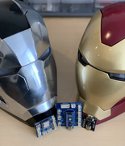
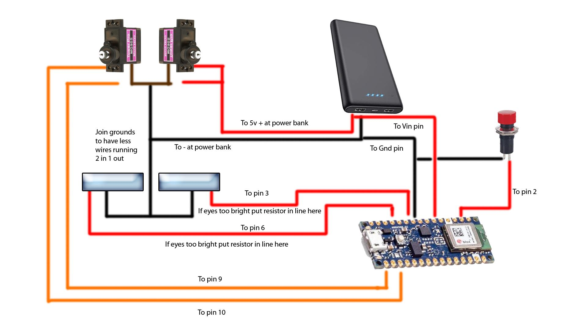
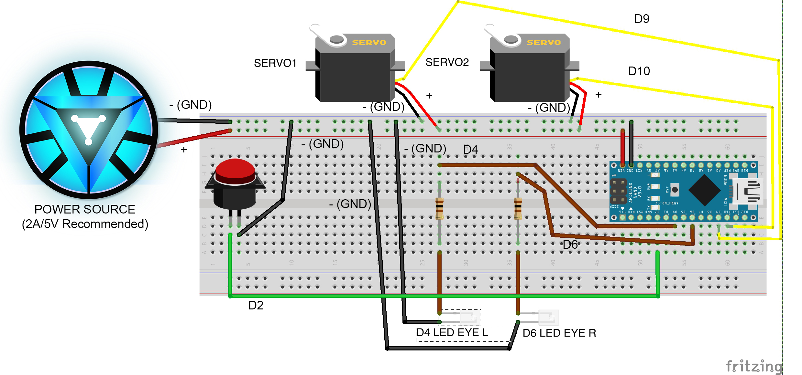

# Iron Man Helmet Servo and Audio Controller for Arduino

The purpose of this project is to automate features of the various models of the Iron Man 3D printed helmet.  This project was created with the purpose of enabling fans like you to be able to more easily make your own automated helmet. We encourage you to learn from this as well as provide feedback for us to improve upon it.

## Follow Me

[![alt text][1.1]][1]  [![alt text][2.1]][2]  [![alt text][3.1]][3]   [![alt text][4.1]][4]    [![alt text][9.1]][9]

[1.1]: images/instagram.png (Instagram - Crash Works 3D)
[2.1]: images/youtube.png (YouTube - Dropwire)
[3.1]: images/github.png (Github - Crash Works)
[4.1]: images/Thingiverse.png (Thingiverse - Crash Works)
[5.1]: images/youtube-preview.jpg (Crash Works 3d - MK85 Helmet Motorization Kit Test v1)
[6.1]: images/youtube-preview_MK7.JPG (Crash Works 3d - MK7 Helmet Motorization Kit Test v1)
[7.1]: images/youtube-preview_Mk46_Closed.JPG (Crash Works 3d - MK46 Helmet Motorization Kit Test v1)
[8.1]: images/youtube-preview_Legends.jpg (Crash Works 3d - Marvel Legends Iron Man / Punisher / War Machine Motorization Kit Test v1)
[9.1]: images/facebook.png (Facebook - Crash Works)
[1]: https://www.instagram.com/crash_works_3d/
[2]: https://www.youtube.com/channel/UCxbZNWPNsDoVIHJfYZQF2Jw
[3]: https://github.com/
[4]: https://www.thingiverse.com/crashworks3d/designs
[5]: https://www.youtube.com/watch?v=dDsZCZuzkQU
[6]: https://www.youtube.com/watch?v=P-p2FFcd4s8&feature=emb_logo
[7]: https://www.youtube.com/watch?v=9Ue6Bggzcgk&feature=emb_logo
[8]: https://www.youtube.com/watch?v=seIPFCSIgJs
[9]: https://www.facebook.com/groups/cosplayspecialeffectsprops

### Actual Use:

[![alt text][5.1]][5]
[![alt text][6.1]][6]
[![alt text][7.1]][7]
[![alt text][8.1]][8]

## **WARNING!!!**

If you have an AM2, AM3 or AM4 board, _**DO NOT USE THIS CODE!!!**_  Use our code in the GitHub repository here: [Iron_Man_Servo_AM](https://github.com/crashworks3d/Iron_Man_Servo_AM).  Attempting to upload this code will void any support and potentially render your board useless.

## Getting Started

It will be helpful but not necessary if you have a basic level of programming experience as well as a little experience programming Arduino micro controllers.  This project was created using the [Arduino IDE](https://www.arduino.cc/).  Clone or download this repository at your own risk.

You can download the 3D printable servo kit from Thingiverse:

[Thingiverse MK85 Iron Man Servo Kit](https://www.thingiverse.com/thing:4607836)

[Thingiverse MK46 Iron Man Servo Kit](https://www.thingiverse.com/thing:4640029)

[Thingiverse MK7 Iron Man Servo Kit](https://www.thingiverse.com/thing:4630066)

[Thingiverse Marvel Legends Iron Man Servo Kit](https://www.thingiverse.com/thing:5175364)

**You can purchase an easy to install and use Arduino shield (Nano included) designed specifically for this project. This Board comes pre-flashed with the Crashworks code installed.**

**_A.L.I.S.H.A._ - Arduino nano Led & Integrated Servo Helmet Actuator for 3D Printed Helmets**

[ebay - A.L.I.S.H.A. / S.U.E. / PENELOPE](https://www.ebay.com/str/crashworks3d)

### Prerequisites

* Some experience with [Arduino](https://www.arduino.cc/)

* Be sure to have the Arduino Nano board installed in your environment.
* Download all of the files from this repository by clicking on Code -> Download Zip 
* Unzip the file and rename the folder to: `Iron_Man_Servo`.
* Install the [VarSpeedServo](https://github.com/netlabtoolkit/VarSpeedServo) library.
* Install the [Bounce2](https://github.com/thomasfredericks/Bounce2) library.
* Install the [ButtonEvents](https://github.com/fasteddy516/ButtonEvents) library.
* Install the [DFRobotDFPlayerMini](https://github.com/DFRobot/DFRobotDFPlayerMini) library. 
* An Arduino Nano board
* Servos
* LEDs
* Resistors

(See BOM below for details.)

### Installing

1.  In the Arduino IDE be sure to set the appropriate board (Arduino Nano) and ports to match your environment.
2. Complile and load onto your Arduino Nano following the [Arduino IDE instructions](https://www.arduino.cc/en/Guide).

Successful installation will result in the servos moving the faceplate into the "closed" or "down" position and the activation of the LED (eyes).  When the button is pushed, the servos will move to the "open" or "up" position and the LED (eyes) will turn off.

## Wiring Diagram

## Breadboard Example

## BOM - A.L.I.S.H.A.
Most components can be found on [Amazon](https://www.amazon.com) or [AliExpress](https://www.aliexpress.com)
* Arduino Nano
* MG90S Servo (metal gear only!)
* Cosplay Iron Man/Batman LEDs (can be found on eBay or AliExpress)

## BOM - S.U.E.
Most components can be found on [Amazon](https://www.amazon.com) or [AliExpress](https://www.aliexpress.com)
* 8Ω Speaker, Maximum 3 Watt
* Micro SD Card , Maximum 8gb (Partioned as FAT32)
* Optional Powered Speaker with 3.5 mm (1⁄8 in) stereo (TRS) connection for use with Auxillary Audio Port

## Configurations

The following table is a list of configurable options found in the `config.h` file.

**!!! WARNING !!!** Making changes to the configurations of your board can have unknown side effects and may cause damage. We strongly advise users to exercise caution when making changes to the board's settings, and to only do so if they have a clear understanding of the potential consequences. Improper changes to the board's configurations may result in permanent damage, loss of functionality, or other issues that could impact its performance. If you are unsure about any changes, please contact us on Frankly Built's discord: [https://discord.gg/franklybuilt](https://discord.gg/franklybuilt). 

| Parameter               | Default           | Options                                   | Comment                                                                          |
|-------------------------|-------------------|-------------------------------------------|----------------------------------------------------------------------------------|
| SOUND                   | Disabled          | Disabled,  Enabled                        | Enables sound                                                                    |
| MP3_TYPE                | DFPLAYER          | DFPLAYER, JQ6500                          | Determines which MP3 player module is being used                                 |
| SND_EFFECT_TYPE         | JARVIS            | JARVIS, FRIDAY                            | Determines which sound effects to use                                            |
| RX_PIN                  | 7                 |                                           | Sets pin for receive (RX) communications                                         |
| TX_PIN                  | 8                 |                                           | Sets pin for transmit (TX) communications                                        |
| VOLUME                  | 29                | 0-30                                      | Sets the volume of the mp3 player                                                |
| SERVO_TYPE              | TPMG90S           | TPMG90S, GENERIC, MANUAL                  | Sets the type of servos being used to determine the PWM high/low values          |
| PWM_HIGH                | 2000              |                                           | Manual Setting of Duty Cycle                                                     |
| PWM_LOW                 | 1000              |                                           | Manual Setting of Duty Cycle                                                     |
| SERVO1_PIN              | 9                 |                                           | Sets pin for servo 1                                                             |
| SERVO2_PIN              | 10                |                                           | Sets pin for servo 2                                                             |
| SERVO_CLOSE_SPEED       | 100               | 0-255                                     | Sets speed of the servo close function                                           |
| SERVO_OPEN_SPEED        | 255               | 0-255                                     | Sets speed of the servo opening recommend set to max speed to aid in lift        |
| SERVO1_OPEN_POS         | 20                | 0-180                                     | Sets open position of servo 1                                                    |
| SERVO2_OPEN_POS         | 160               | 0-180                                     | Sets open position of servo 2                                                    |
| SERVO1_CLOSE_POS        | 160               | 0-180                                     | Sets closed position of servo 1                                                  |
| SERVO2_CLOSE_POS        | 20                | 0-180                                     | Sets closed position of servo 2                                                  |
| BUTTON_PIN              | 2                 |                                           | Sets pin of primary switch                                                       |
| LEFT_EYE_PIN            | 6                 |                                           | Sets pin for left eye LED                                                        |
| RIGHT_EYE_PIN           | 3                 |                                           | Sets pin for right eye LED                                                       |
| EYES_FX                 | EYES_FADE_ON      | EYES_NONE, EYES_MOVIE_BLINK, EYES_FADE_ON | Special effect when faceplate closes                                             |
| SETUP_FX                | SETUP_MOVIE_BLINK | EYES_NONE, EYES_MOVIE_BLINK, EYES_FADE_ON | Determines which special effect to enable during startup                         |
| AUX_LED_PIN             | 4                 |                                           | Sets pin for Aux LED non-PWM                                                     |
| AUX_LED_ENABLED         | TRUE              | TRUE,  FALSE                              | Enables aux led code to run                                                      |
| WALSH85                 | Disabled          | Disabled,  Enabled                        | Walsh3D MK85 Jaw Control (Open/Close)                                            |
| SERVO3_PIN              | 5                 |                                           | Sets pin for servo 3 (Walsh85 Jaw Control)                                       |
| CHIN_CLOSE_SPEED        | 175               | 0-255                                     | Sets speed of the Jaw closing for Walsh85 Helmet                                 |
| CHIN_OPEN_SPEED         | 255               | 0-255                                     | Sets speed of the Jaw opening for Walsh85 Helmet                                 |
| SERVO3_OPEN_POS         | 90                | 0-180                                     | Sets open position of servo 3                                                    |
| SERVO3_CLOSE_POS        | 0                 | 0-180                                     | Sets closed position of servo 3                                                  |
| MISSILE                 | Disabled          | Disabled,  Enabled                        | Enables forearm missile special effects                                          |
| SERVO4_PIN              | 4                 |                                           | Sets pin for servo 3 (missile bay)                                               |
| SERVO5_PIN              | 11                |                                           | Sets pin for servo 4 (missile)                                                   |
| MISSILE_PIN             | 12                |                                           | Sets pin for missile button                                                      |
| MISSILE_OPEN_SPEED      | 200               | 0-255                                     | Sets speed of the missile moving into launch position                            |
| MISSILE_CLOSE_SPEED     | 60                | 0-255                                     | Sets speed of the missile retracting                                             |
| MISSILE_BAY_OPEN_SPEED  | 200               | 0-255                                     | Sets opening speed of the missile bay                                            |
| MISSILE_BAY_CLOSE_SPEED | 60                | 0-255                                     | Sets closing speed of the missile bay                                            |
| SERVO4_OPEN_POS         | 180               | 0-180                                     | Sets open position of servo 4                                                    |
| SERVO4_CLOSE_POS        | 0                 | 0-180                                     | Sets closed position of servo 4                                                  |
| SERVO5_OPEN_POS         | 180               | 0-180                                     | Sets open position of servo 5                                                    |
| SERVO5_CLOSE_POS        | 0                 | 0-180                                     | Sets closed position of servo 5                                                  |
| MISSILE_BAY_DELAY       | 1000              |                                           | Amount of time (ms) to delay between movement of the missile bay and the missile |

## Built With

* [Arduino](https://www.arduino.cc/)

## Versioning

Version Beta 3.1.0.2 (Use at your own risk) 

## Authors

* **Dropwire**

* **Cranshark @ i3 Creations**

## License

This project is licensed under the MIT License - see the [LICENSE.md](LICENSE.md) file for details

## Acknowledgments/ Hat Tip
* [XL97](https://www.therpf.com/forums/members/xl97.9819/)
* [i3 Creations, LLC](https://github.com/i3creations)
* [Dropwire](https://github.com/Acollazo7)
* [Arduino](https://www.arduino.cc/)
* [Fritzing](https://fritzing.org/)
